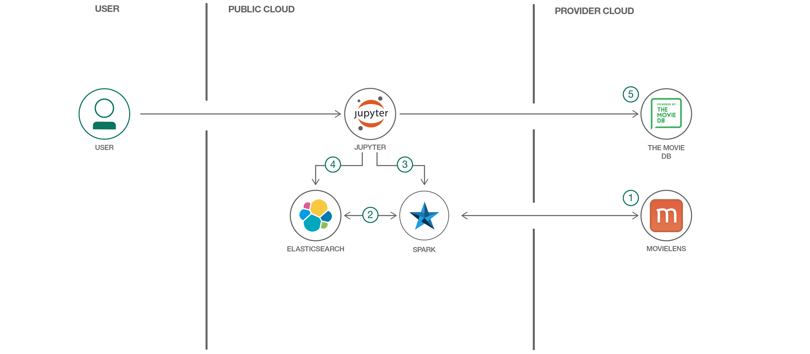
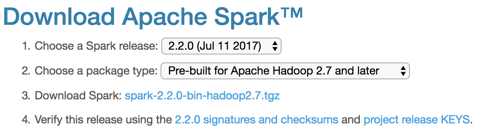

# 基于 Apache Spark 和 Elasticsearch 的可伸缩的推荐系统

本系统通过存储在 Elasticsearch 中的用户行为数据，使用 Spark 来训练一个协同过滤推荐模型，并将训练好的模型保存到 Elasticsearch，然后使用 Elasticsearch 通过该模型来提供实时推荐。以此达到离线训练，在线推荐的目的。

因为使用了 Elasticsearch 插件，系统除了能够提供个性化用户和类似条目推荐，还能够将推荐与搜索和内容过滤相结合。

本文主要描述了如下内容：

* 使用 Elasticsearch Spark 连接器将用户行为数据导入到 Elasticsearch 中并建立索引。
* 将行为数据加载到 Spark DataFrames 中，并使用 Spark 的机器学习库 (MLlib) 来训练一个协同过滤推荐系统模型。
* 将训练后的模型导出到 Elasticsearch 中。
* 使用一个自定义 Elasticsearch 插件，计算 _个性化用户_ 和 _类似条目_ 推荐，并将推荐与搜索和内容过滤相结合。



## 操作流程
1. 将数据集加载到 Spark 中。
2. 使用 Spark DataFrame 操作清理该数据集，并将它加载到 Elasticsearch 中。
3. 使用 Spark MLlib，离线训练一个协同过滤推荐模型。
4. 将得到的模型保存到 Elasticsearch 中。
5. 使用 Elasticsearch 查询和一个自定义矢量评分插件，在线生成用户推荐。

## 包含的组件
* [Apache Spark](http://spark.apache.org/)：一个开源、快速、通用的集群计算系统。
* [Elasticsearch](http://elasticsearch.org)：开源搜索和分析引擎。
* [Elasticsearch Vector Scoring](https://github.com/MLnick/elasticsearch-vector-scoring)：A plugin allows you to score documents based on arbitrary raw vectors, using dot product or cosine similarity.

# 步骤
按照以下步骤部署所需的部件，并创建推荐服务。

1. [设置 Elasticsearch](#1-set-up-elasticsearch)
2. [下载 Elasticsearch Spark 连接器](#2-download-the-elasticsearch-spark-connector)
3. [下载 Apache Spark](#3-download-apache-spark)
4. [数据准备](#4-prepare-the-data)
5. [代码结构](#5-code-structure)
6. [推荐过程](#6-recommendation-process)

### 1.设置 Elasticsearch

此推荐系统目前依赖于 Elasticsearch 5.3.0。转到[下载页面](https://www.elastic.co/downloads/past-releases/elasticsearch-5-3-0)，下载适合您的系统的包。

如果在 Linux / Mac 上，可以下载 [TAR 归档文件](https://artifacts.elastic.co/downloads/elasticsearch/elasticsearch-5.3.0.tar.gz) 并使用以下命令进行解压：

```
$ wget https://artifacts.elastic.co/downloads/elasticsearch/elasticsearch-5.3.0.tar.gz
$ tar xfz elasticsearch-5.3.0.tar.gz
```

使用以下命令，将目录更改为新解压的文件夹：

```
$ cd elasticsearch-5.3.0
```

接下来安装 [Elasticsearch 矢量评分插件](https://github.com/MLnick/elasticsearch-vector-scoring)。运行以下命令（Elasticsearch 将为您下载插件文件）：

```
$ ./bin/elasticsearch-plugin install https://github.com/MLnick/elasticsearch-vector-scoring/releases/download/v5.3.0/elasticsearch-vector-scoring-5.3.0.zip
```

接下来，启动 Elasticsearch（在一个单独的终端窗口中这么做，使其保持正常运行）：

```
$ ./bin/elasticsearch
```

您会看到一些显示的启动日志。如果显示 `elasticsearch-vector-scoring-plugin` 则插件已成功加载：

```
$ ./bin/elasticsearch
[2017-09-08T15:58:18,781][INFO ][o.e.n.Node               ] [] initializing ...
...
[2017-09-08T15:58:19,406][INFO ][o.e.p.PluginsService     ] [2Zs8kW3] loaded plugin [elasticsearch-vector-scoring]
[2017-09-08T15:58:20,676][INFO ][o.e.n.Node               ] initialized
...
```

最后安装 Elasticsearch Python 客户端。运行以下命令（执行此命令时使用的终端窗口应该与运行 Elasticsearch 的终端窗口不同）：

```
$ pip install elasticsearch
```

如果系统安装了Anaconda，也可以使用conda install命令来安装。

### 2.下载 Elasticsearch Spark 连接器

[Elasticsearch Hadoop 项目](https://www.elastic.co/products/hadoop) 提供了 Elasticsearch 与各种兼容 Hadoop 的系统（包括 Spark）之间的连接器。该项目提供了一个 ZIP 文件供下载，其中包含所有这些连接器。此推荐系统需要将特定于 Spark 的连接器 JAR 文件放在类路径上。按照以下步骤设置连接器：

1.[下载](http://download.elastic.co/hadoop/elasticsearch-hadoop-5.3.0.zip) `elasticsearch-hadoop-5.3.0.zip` 文件，其中包含所有连接器。为此，可以运行：
```
$ wget http://download.elastic.co/hadoop/elasticsearch-hadoop-5.3.0.zip
```
2.运行以下命令来解压该文件：
```
$ unzip elasticsearch-hadoop-5.3.0.zip
```
3.Spark 连接器的 JAR 名为 `elasticsearch-spark-20_2.11-5.3.0.jar`，它将位于您解压上述文件所用的目录的 `dist` 子文件夹中。

### 3.下载 Apache Spark

本推荐系统适用于任何 Spark 2.x 版本，从[下载页面](http://spark.apache.org/downloads.html) 下载最新版 Spark（目前为 2.2.0）。运行以下命令来解压它：
```
$ tar xfz spark-2.2.0-bin-hadoop2.7.tgz
```

> *请注意，如果下载不同的版本，应该相应地调整上面使用的相关命令和其他地方。*



Spark 的机器学习库 [MLlib](http://spark.apache.org/mllib)依赖于 [Numpy](http://www.numpy.org)，运行以下命令安装 Numpy：
```
$ pip install numpy
```

### 4.数据准备

推荐系统依赖于一个用户行为数据集，用户行为包括浏览、购买资源。如果只记录了购买行为，那么暂时就只以此行为构建数据集。

数据集中的每条数据是一个多元组，其中包括：
* userId，全局唯一的用户Id，这里的用户是指真实购买资源的广告主，而不是在系统中进行操作的代理商。
* itemId，全局唯一的资源Id，这里的资源是指可以展示广告的广告位。
* rating，用户评分，系统目前没有真实的用户评分行为，我们将用户的浏览、购买行为等价为评分。一次浏览为3分，一次购买为5分。
* timeStamp，时间戳，用户产生这次行为的时间，时间精确到秒。

> 数据文件的格式可以参考 [Movielens Small 数据集](datasets/ml-latest-small/)，其中 ratings.csv 包含一组用户提供的电影评分。文件夹中还有另外几个 .csv 文件，包含如电影名称、用户标签等元数据。README.txt 中有对数据文件格式的详细说明，我们的数据文件可以照此准备。

### 5.代码结构

推荐模块包中有如下几个文件：
* __init__.py，定义包中要引用的其它属性和方法。
* dataset.py，使用 Spark 读取原始的数据文件，转换为 Dataframe 便于训练和评测模型的训练集和测试集。
* esoperation.py，创建在 Elasticsearch 的索引，用于保存训练好的模型数据和其它元数据。
* prediction.py，基于保存在 Elasticsearch 中的数据，通过elasticsearch-vector-scoring插件中的余弦相似度算法来对用户喜好做出预测。
* trainmodel.py，用于模型训练，核心算法采用 pyspark.ml.recommendation 包中的ALS。
* recommender.py，构建从数据准备、模型训练到完成预测的 pipeline，业务系统调用推荐系统的入口。

> 本代码适用于 Python 3.x，已在 3.6.5 上完成测试。
> 包中每个 .py 文件都带有 \_test() 方法，可以看作是单元测试，用于测试类中的方法是否正确。

### 6.推荐过程

本推荐系统采用离线训练、在线推荐的模式，模型训练的入口是 recommender.py 文件，在线推荐的入口是 Elasticsearch 的 RESTful 接口。

1. 如果要训练模型，可以打开一个终端窗口中，切换到推荐模块包所在的文件夹，然后执行以下命令：
```
$ python recommender.py
```

命令执行完毕，模型就已训练好并存入 Elasticsearch 备用。

> 理想状态下，当业务系统中产生新的用户行为数据，模型也应该重新训练。但是模型训练本身是一个耗时的过程，且会占用较高的 CPU 和内存，所以可以根据用户行为数据的变化频率与业务系统对模型准确性的要求，定时地执行建模过程，在资源与性能之间取得一个平衡。

2. 因为训练好的模型与元数据都保存在 Elasticsearch 中，所以最终业务系统是通过调用 Elasticsearch 原生的 RESTful 接口产生推荐结果。创建索引与执行查询与正常的 Elasticsearch 使用方式没有区别。

> 如下是推荐系统在 Elasticsearch 上创建的索引结构：
```
index_body = {
    "settings": {
        "analysis": {
            "analyzer": {
                # this configures the custom analyzer we need to parse
                # vectors such that the scoring plugin will work correctly
                "payload_analyzer": {
                    "type": "custom",
                    "tokenizer":"whitespace",
                    "filter":"delimited_payload_filter"
                }
            }
        }
    },
    "mappings": {
        "ratings": {
          # this mapping definition sets up the fields for the rating
          # events
          "properties": {
                "userId": {
                    "type": "integer"
                },
                "movieId": {
                    "type": "integer"
                },
                "rating": {
                    "type": "double"
                },
                "timestamp": {
                    "type": "date"
                }
            }  
        },
        "users": {
            # this mapping definition sets up the metadata fields for 
            # the users
            "properties": {
                "userId": {
                    "type": "integer"
                },
                "@model": {
                    # this mapping definition sets up the fields for user
                    # factor vectors of our model
                    "properties": {
                        "factor": {
                            "type": "text",
                            "term_vector": "with_positions_offsets_payloads",
                            "analyzer" : "payload_analyzer"
                        },
                        "version": {
                            "type": "keyword"
                        },
                        "timestamp": {
                            "type": "date"
                        }
                    }
                }
            }
        },
        "movies": {
            # this mapping definition sets up the metadata fields for
            # the movies
            "properties": {
                "movieId": {
                    "type": "integer"
                },
                "tmdbId": {
                    "type": "keyword"
                },
                "genres": {
                    "type": "keyword"
                },
                "release_date": {
                    "type": "date",
                    "format": "year"
                },
                "@model": {
                    # this mapping definition sets up the fields for 
                    # movie factor vectors of our model
                    "properties": {
                        "factor": {
                            "type": "text",
                            "term_vector": "with_positions_offsets_payloads",
                            "analyzer" : "payload_analyzer"
                        },
                        "version": {
                            "type": "keyword"
                        },
                        "timestamp": {
                            "type": "date"
                        }
                    }
                }
            }
        }
    }
}
```
3. 推荐是一个由若干个步骤组成的 pipeline，如果想对整个过程有个感性的认识，可以参考[pipeline 示例](doc/elasticsearch-spark-recommender-small.ipynb)。

> .ipynb 是 运行于Jupyter 之上的 Notebook 文件，要运行该 Notebook，需要在一个 Jupyter 中启动一个 PySpark 会话。如果没有安装 Jupyter，可以运行以下命令来安装它：
```
$ pip install jupyter
```

> 在启动 Jupyter 时，需要在类路径上包含来自[第 2 步](#2-download-the-elasticsearch-spark-connector) 的 Elasticsearch Spark 连接器 JAR。命令如下：
```
PYSPARK_DRIVER_PYTHON="jupyter" PYSPARK_DRIVER_PYTHON_OPTS="notebook" ../spark-2.2.0-bin-hadoop2.7/bin/pyspark --driver-memory 4g --driver-class-path ../../elasticsearch-hadoop-5.3.0/dist/elasticsearch-spark-20_2.11-5.3.0.jar
```

> 执行一个 Notebook 时，实际情况是，按从上往下的顺序执行该 Notebook 中的每个代码单元。可以选择每个代码单元，并在代码单元前面的左侧空白处添加一个标记。标记格式为 `In [x]:`。根据 Notebook 的状态，`x` 可以是：
> * 空白，表示该单元从未执行过。
> * 一个数字，表示执行此代码步骤的相对顺序。
> * 一个`*`，表示目前正在执行该单元。


